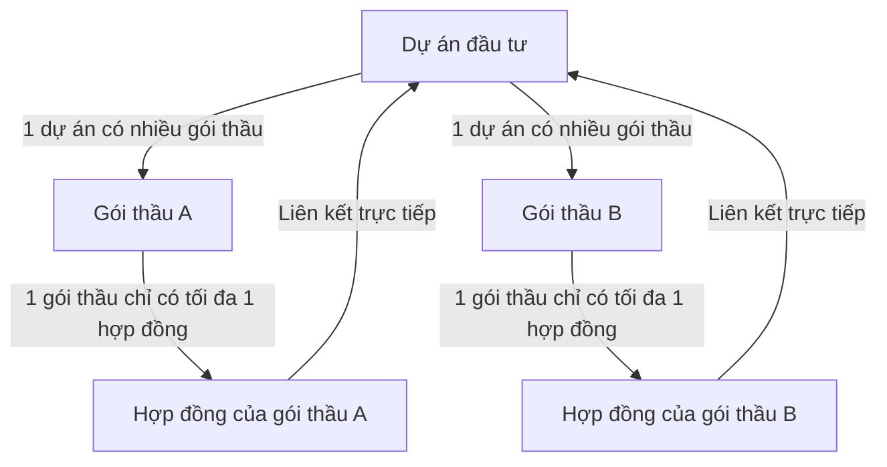

# HƯỚNG DẪN TÍCH HỢP API CHO FRONTEND

Tài liệu này giải thích chi tiết luồng dữ liệu, các khái niệm nghiệp vụ và cách gọi các API mới để xây dựng giao diện chi tiết dự án.

---

## 1. Sơ đồ Mối Quan Hệ Nghiệp Vụ (Concept)

- **Dự án (Project)**: Có một hạn mức ngân sách nhất định (`DuToanPheDuyet` + các đợt điều chỉnh hạn mức `DieuChinhDuAns`).
- **Gói thầu (Bidding Package)**: Phải trực thuộc một dự án cụ thể. Tổng giá trị của các gói thầu không được phép vượt quá ngân sách hiện tại của dự án đó.
- **Hợp đồng (Contract)**: Liên kết trực tiếp với 1 Gói thầu và 1 Dự án. Mỗi Gói thầu chỉ được phép liên kết duy nhất với một Hợp đồng (quan hệ 1-1).

---

## 2. Các API và Luồng xử lý tại Trang Chi Tiết Dự Án (Project Detail)

Khi Frontend render màn hình chi tiết dự án, bạn sẽ cần gọi các API tương ứng với từng Tab thông tin như sau:

### Tab 1: Thông tin chung (General Info)
* **API chi tiết dự án**: `GET /api/du-an/{id}`
  * *Mục đích*: Lấy toàn bộ thông tin chi tiết dự án để hiển thị.
* **API Chuyển trạng thái dự án (Nút "Chuyển sang [Trạng thái tiếp theo]")**: `POST /api/du-an/{id}/advance-status`
  * *Mục đích*: Chuyển tiếp trạng thái của dự án theo vòng đời: *Bản nháp (1) -> Đã trình (2) -> Đã duyệt (3) -> Đang triển khai (4) -> Nghiệm thu (5) -> Thanh toán (6) -> Quyết toán (7) -> Hoàn thành (8)*.
  * *Kết quả trả về*: Object dự án đã cập nhật trạng thái mới.
* **API Đóng dự án (Nút "Đóng dự án")**: `POST /api/du-an/{id}/close`
  * *Mục đích*: Dành riêng cho dự án đã ở trạng thái Quyết toán. Chuyển trạng thái dự án thành Hoàn thành (8) và đánh dấu `DaKetThuc = true`.

### Tab 2: Gói thầu (Bidding Packages)
* **API lấy danh sách gói thầu thuộc dự án**: `GET /api/du-an/{id}/goi-thau`
  * *Mục đích*: Hiển thị danh sách các gói thầu của riêng dự án này.
* **API tạo mới gói thầu**: `POST /api/goi-thau`
  * *Request Body*: Gửi kèm trường `"duAnId": "ID_DỰ_ÁN"`.
  * *Xử lý lỗi*: Nếu tổng ngân sách các gói thầu vượt quá dự toán dự án, API sẽ trả về mã `400` kèm thông báo lỗi cụ thể để Frontend hiển thị lên giao diện.

### Tab 3: Hợp đồng (Contracts)
* **API lấy danh sách hợp đồng thuộc dự án**: `GET /api/du-an/{id}/hop-dong`
  * *Mục đích*: Tải và hiển thị danh sách các hợp đồng liên quan trực tiếp đến dự án này.
* **API tạo mới hợp đồng**: `POST /api/hop-dong`
  * *Request Body*: Cần gửi lên cả `"duAnId": "ID_DỰ_ÁN"` và `"goiThauId": "ID_GÓI_THẦU"`.
  * *Xử lý lỗi*: Gói thầu được chọn phải chưa được ký với bất kỳ hợp đồng nào khác, nếu không API sẽ trả lỗi `400` báo trùng lặp liên kết.

### Tab 4: Nhật ký thay đổi (Audit Logs)
* **API lấy toàn bộ log liên quan**: `GET /api/du-an/{id}/audit-log`
  * *Mục đích*: Lấy toàn bộ lịch sử thao tác của tất cả các đối tượng liên đới đến dự án này (bao gồm log của bản thân dự án, log đợt điều chỉnh vốn, log của các gói thầu con, và log của các hợp đồng con).
  * *Frontend sử dụng*: Render thành một dạng Timeline lịch sử hiển thị thông tin: *Ai đã làm (Username), Hành động gì (Action - CREATE/UPDATE/DELETE), Thao tác trên bảng nào (TableName - DuAns/GoiThaus/HopDongs) và thời điểm (Timestamp)*.
