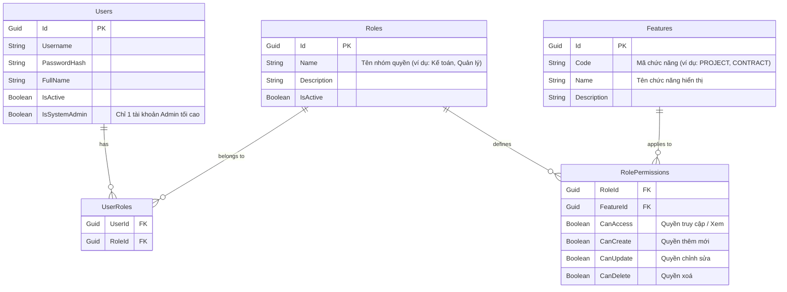

# Thiết Kế Hệ Thống Phân Quyền Chi Tiết (Role-Based Access Control - RBAC)

Bản thiết kế này giải quyết yêu cầu phân quyền trong hệ thống với các tiêu chí:
1. Một người dùng thuộc nhiều Nhóm quyền (Role Groups).
2. Mỗi Nhóm quyền cấu hình bật/tắt các quyền **Truy cập (Read)**, **Thêm (Create)**, **Sửa (Update)**, **Xoá (Delete)** cho từng **Chức năng (Feature)**.
3. Chỉ tài khoản Admin hệ thống (System Admin) mới có quyền chỉnh sửa nhóm quyền và cấu hình vai trò cho người dùng khác.

---

## 1. Thiết Kế Cơ Sở Dữ Liệu (SQL Server Database Schema)

Để đáp ứng yêu cầu trên, chúng ta bổ sung/cập nhật các bảng trong database như sau:



### Các tập lệnh SQL tạo bảng chi tiết:

```sql
-- 1. Bảng Chức năng (Features)
IF OBJECT_ID(N'dbo.Features', N'U') IS NULL
BEGIN
    CREATE TABLE dbo.Features
    (
        Id UNIQUEIDENTIFIER NOT NULL CONSTRAINT DF_Features_Id DEFAULT (NEWSEQUENTIALID()) CONSTRAINT PK_Features PRIMARY KEY,
        Code NVARCHAR(100) NOT NULL,
        Name NVARCHAR(200) NOT NULL,
        Description NVARCHAR(500) NULL,
        IsActive BIT NOT NULL CONSTRAINT DF_Features_IsActive DEFAULT (1),
        CreatedAt DATETIME2(0) NOT NULL CONSTRAINT DF_Features_CreatedAt DEFAULT (SYSUTCDATETIME()),
        CONSTRAINT UQ_Features_Code UNIQUE (Code)
    );
END
GO

-- 2. Bảng Phân quyền cho Nhóm (RolePermissions)
IF OBJECT_ID(N'dbo.RolePermissions', N'U') IS NULL
BEGIN
    CREATE TABLE dbo.RolePermissions
    (
        RoleId UNIQUEIDENTIFIER NOT NULL,
        FeatureId UNIQUEIDENTIFIER NOT NULL,
        CanAccess BIT NOT NULL CONSTRAINT DF_RolePermissions_CanAccess DEFAULT (0),
        CanCreate BIT NOT NULL CONSTRAINT DF_RolePermissions_CanCreate DEFAULT (0),
        CanUpdate BIT NOT NULL CONSTRAINT DF_RolePermissions_CanUpdate DEFAULT (0),
        CanDelete BIT NOT NULL CONSTRAINT DF_RolePermissions_CanDelete DEFAULT (0),
        UpdatedAt DATETIME2(0) NOT NULL CONSTRAINT DF_RolePermissions_UpdatedAt DEFAULT (SYSUTCDATETIME()),
        CONSTRAINT PK_RolePermissions PRIMARY KEY (RoleId, FeatureId),
        CONSTRAINT FK_RolePermissions_Roles FOREIGN KEY (RoleId) REFERENCES dbo.Roles(Id) ON DELETE CASCADE,
        CONSTRAINT FK_RolePermissions_Features FOREIGN KEY (FeatureId) REFERENCES dbo.Features(Id) ON DELETE CASCADE
    );
END
GO

-- 3. Bổ sung cột IsSystemAdmin vào bảng Users (để xác định admin duy nhất kiểm soát phân quyền)
IF NOT EXISTS(SELECT 1 FROM sys.columns WHERE Name = N'IsSystemAdmin' AND Object_ID = OBJECT_ID(N'dbo.Users'))
BEGIN
    ALTER TABLE dbo.Users ADD IsSystemAdmin BIT NOT NULL CONSTRAINT DF_Users_IsSystemAdmin DEFAULT (0);
END
GO
```

---

## 2. Quy Tắc Xác Định Quyền (Backend Authorization Logic)

Khi một người dùng thực hiện yêu cầu (Request), Backend kiểm tra quyền của người dùng dựa trên nguyên tắc **Hợp của tất cả các nhóm quyền (Union of permissions)**:
- Nếu người dùng có `IsSystemAdmin = 1` -> Bỏ qua mọi bước kiểm tra, tự động cho phép toàn quyền.
- Nếu người dùng thông thường thuộc nhiều nhóm quyền, quyền thực tế cho chức năng $F$ được tính bằng phép toán OR logic:
  - $\text{CanAccess}_{\text{User}} = \sum_{r \in \text{Roles}} \text{CanAccess}_{r, F}$
  - $\text{CanCreate}_{\text{User}} = \sum_{r \in \text{Roles}} \text{CanCreate}_{r, F}$
  - $\text{CanUpdate}_{\text{User}} = \sum_{r \in \text{Roles}} \text{CanUpdate}_{r, F}$
  - $\text{CanDelete}_{\text{User}} = \sum_{r \in \text{Roles}} \text{CanDelete}_{r, F}$
  *(Chỉ cần 1 nhóm quyền cho phép thì người dùng sẽ có quyền đó).*

---

## 3. Thiết Kế APIs Backend

Chỉ cho phép tài khoản có `IsSystemAdmin = true` gọi các APIs này:

| HTTP Method | API Endpoint | Chức năng | Body / Params |
|:---|:---|:---|:---|
| **GET** | `/api/admin/roles` | Lấy danh sách nhóm quyền | Không |
| **POST** | `/api/admin/roles` | Tạo mới nhóm quyền | `{ Name, Description }` |
| **PUT** | `/api/admin/roles/{roleId}` | Cập nhật thông tin nhóm quyền | `{ Name, Description, IsActive }` |
| **GET** | `/api/admin/roles/{roleId}/permissions` | Lấy danh sách cấu hình quyền theo nhóm | Không |
| **PUT** | `/api/admin/roles/{roleId}/permissions` | Lưu cấu hình bật/tắt quyền cho nhóm | Mảng đối tượng chứa `{ FeatureId, CanAccess, CanCreate, CanUpdate, CanDelete }` |
| **GET** | `/api/admin/users/{userId}/roles` | Lấy danh sách nhóm quyền của một người dùng | Không |
| **PUT** | `/api/admin/users/{userId}/roles` | Gán các nhóm quyền cho người dùng | `{ RoleIds: [guid, guid, ...] }` |

---

## 4. Thiết Kế Giao Diện Frontend (Admin Dashboard)

### Giao diện quản lý vai trò người dùng (User Management Roles Settings)
- **Danh sách người dùng**: Hiển thị danh sách nhân viên kèm cột "Nhóm quyền đang giữ".
- **Modal thiết lập quyền**: Khi nhấn "Cấu hình vai trò", hiển thị hộp thoại chứa danh sách checkbox các Nhóm quyền có sẵn (Kế toán, Kỹ thuật, Ban giám đốc...). Admin có thể tích chọn nhiều nhóm quyền cho một người dùng.

### Giao diện quản lý cấu hình nhóm quyền (Role Permissions Configuration Matrix)
Admin cấu hình quyền bật/tắt dưới dạng bảng ma trận (Permission Matrix):

| Tên chức năng | Truy cập (Xem) | Thêm mới | Chỉnh sửa | Xoá |
| :--- | :---: | :---: | :---: | :---: |
| **Quản lý Dự Án** | [x] | [x] | [x] | [ ] |
| **Quản lý Hợp Đồng** | [x] | [ ] | [ ] | [ ] |
| **Quản lý Đối Tác** | [x] | [x] | [ ] | [ ] |
| **Quản lý Tài Liệu** | [x] | [x] | [x] | [x] |

---

## Verification Plan

### Manual Verification
1. Đăng nhập với tài khoản có `IsSystemAdmin = 1` -> Kiểm tra giao diện Quản trị có xuất hiện và cho phép sửa nhóm quyền không.
2. Đăng nhập với tài khoản thường -> Kiểm tra các API quản trị nhóm quyền trả về `403 Forbidden`.
3. Gán cho User A hai nhóm quyền:
   - Nhóm 1: Xem dự án (CanAccess = 1, CanCreate = 0)
   - Nhóm 2: Thêm dự án (CanAccess = 0, CanCreate = 1)
   -> Xác minh User A vừa Xem được vừa Thêm mới được dự án (Nguyên tắc OR quyền).
