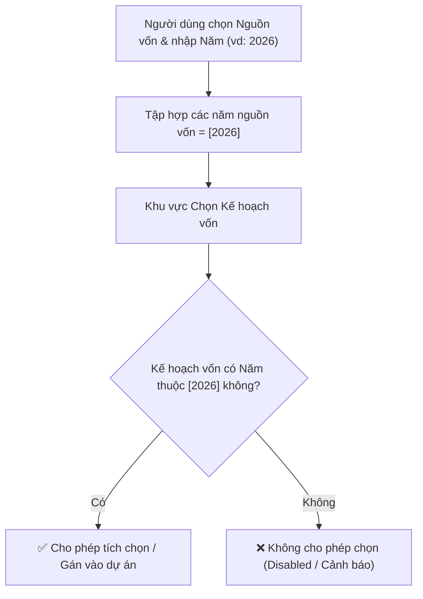

# Hướng Dẫn Tích Hợp Frontend: Chọn Kế Hoạch Vốn Cho Dự Án

Tài liệu này hướng dẫn chi tiết cho phía Frontend (FE) về các thay đổi DTO, quy tắc nghiệp vụ (validation logic), danh sách API liên quan và hướng dẫn cập nhật UI khi tích hợp tính năng **Chọn Kế hoạch vốn khi Thêm mới / Cập nhật Dự án**.

---

## 1. Cập nhật Typescript Interfaces / Models

### 1.1. Model chi tiết Kế hoạch vốn của Dự án (`DuAnKeHoachVonDto`)

```typescript
export interface DuAnKeHoachVonDto {
  keHoachVonId: string;
  soQuyetDinh?: string;
  tenKeHoachVon?: string;
  namKeHoach: number;
  loaiKeHoach: number;          // 1: 6 tháng đầu năm, 2: Cả năm, 3: Bổ sung
  loaiKeHoachText?: string;
  trangThai: number;            // 1: Nháp, 2: Đã trình, 3: Đã duyệt, 4: Trả về
  trangThaiText?: string;
  soTienDeNghi: number;
  soTienDuocDuyet: number;
  vonDieuLe?: number;
  quyDauTuPhatTrien?: number;
  ghiChu?: string;
}

export interface CreateDuAnKeHoachVonDto {
  keHoachVonId: string;
  soTienDeNghi?: number;
  soTienDuocDuyet?: number;
  vonDieuLe?: number;
  quyDauTuPhatTrien?: number;
  ghiChu?: string;
}
```

### 1.2. Model Dự án (`DuAnDto`) - Response trả về từ Backend

Bổ sung 2 trường `danhSachKeHoachVon` và `keHoachVonIds`:

```typescript
export interface DuAnDto {
  id: string;
  code: string;
  name: string;
  description?: string;
  duToanPheDuyet: number;
  tongDuToanHienTai: number;
  trangThai: number;
  danhSachNguonVon?: DuAnNguonVonDto[];
  phanKyVons?: DuAnPhanKyVonDto[];
  
  // === BỔ SUNG MỚI ===
  /** Danh sách các đợt Kế hoạch vốn dự án tham gia */
  danhSachKeHoachVon: DuAnKeHoachVonDto[];

  /** Danh sách GUID các Kế hoạch vốn đã gán (dùng bind vào MultiSelect/Combobox) */
  keHoachVonIds: string[];
}
```

### 1.3. Model Tạo mới & Cập nhật Dự án (`CreateDuAnDto` & `UpdateDuAnDto`)

FE có thể truyền danh sách ID Kế hoạch vốn hoặc chi tiết đợt kế hoạch vốn:

```typescript
export interface CreateDuAnDto {
  code: string;
  name: string;
  description?: string;
  duToanPheDuyet: number;
  trangThai?: number;
  nhomDuAnId?: string;
  phanLoaiDuAnId?: string;
  chuDauTu?: string;
  diaDiemThucHien?: string;
  thoiGianThucHien?: string;
  noiDung?: string;
  hinhThucQuanLy?: number;
  toChucThucHien?: string;
  ngayBatDau?: string;
  ngayKetThuc?: string;
  ngayKetThucThucTe?: string;
  namBatDau?: number;
  namKetThuc?: number;
  daKetThuc?: boolean;
  soQuyetDinh?: string;
  soQuyetDinhPheDuyetDuToan?: string;
  chuDuAnId?: string;
  phanKyVons?: CreateDuAnPhanKyVonDto[];
  danhSachNguonVon?: CreateDuAnNguonVonDto[];

  // === BỔ SUNG MỚI ===
  /** Danh sách ID Kế hoạch vốn cần gán (cách truyền đơn giản) */
  keHoachVonIds?: string[];

  /** Chi tiết Kế hoạch vốn cần gán nếu muốn tùy chỉnh số tiền/ghi chú */
  danhSachKeHoachVon?: CreateDuAnKeHoachVonDto[];
}

export interface UpdateDuAnDto extends CreateDuAnDto {
  sourceProjectIds?: string[];
}
```

---

## 2. Quy Tắc Nghiệp Vụ & Validation Logic



1. **Ràng buộc năm nguồn vốn**:
   - Dự án **chỉ được phép gán vào Kế hoạch vốn** nếu tồn tại ít nhất một nguồn vốn trong `danhSachNguonVon` có `nam == namKeHoach`.
   - Nếu dự án không có nguồn vốn nào thuộc năm của Kế hoạch vốn đó, Backend sẽ từ chối và trả về lỗi `400 Bad Request`:
     ```json
     {
       "message": "Không thể gán dự án vào Kế hoạch vốn 'KHV-2027 (Cả năm)' (năm 2027) do dự án không có nguồn vốn nào thuộc năm 2027."
     }
     ```

2. **Xử lý số tiền mặc định**:
   - Khi FE chỉ truyền `keHoachVonIds: ["guid-id"]` (không truyền `soTienDeNghi` cụ thể), Backend tự động tính:
     - `soTienDeNghi` = Tổng số tiền của các nguồn vốn có cùng năm với Kế hoạch vốn (nếu không có thì lấy `duToanPheDuyet`).
     - `soTienDuocDuyet` = `soTienDeNghi`.

3. **Cập nhật / Đồng bộ**:
   - Khi sửa dự án (`PUT /api/NghiepVu/du-an/{id}`), nếu FE gửi `keHoachVonIds` hoặc `danhSachKeHoachVon`, hệ thống sẽ đồng bộ lại quan hệ (xóa liên kết cũ bị bỏ chọn, thêm mới liên kết mới, cập nhật số tiền liên kết hiện tại).

---

## 3. Danh Sách API Liên Quan

| STT | Nghiệp vụ | Method | Endpoint | Request / Query Params | Mô tả |
| :--- | :--- | :---: | :--- | :--- | :--- |
| 1 | **Lấy danh sách Kế hoạch vốn** | `GET` | `/api/NghiepVu/ke-hoach-von` | `?nam={year}&trangThai=3` | Lấy danh sách đợt KHV để hiển thị dropdown/combobox chọn |
| 2 | **Lấy chi tiết dự án** | `GET` | `/api/NghiepVu/du-an/GetById/{id}` | - | Trả về `danhSachKeHoachVon` và `keHoachVonIds` |
| 3 | **Tạo mới dự án** | `POST` | `/api/NghiepVu/du-an` | `CreateDuAnDto` | Truyền `keHoachVonIds` hoặc `danhSachKeHoachVon` |
| 4 | **Cập nhật dự án** | `PUT` | `/api/NghiepVu/du-an/{id}` | `UpdateDuAnDto` | Truyền danh sách KHV mới để đồng bộ |
| 5 | **Gộp tạo dự án mới** | `POST` | `/api/NghiepVu/du-an/gop-tao-du-an-moi` | `GopTaoDuAnMoiDto` | Cho phép gán KHV cho dự án mới sau gộp |

---

## 4. Hướng Dẫn Triển Khai Trên Giao Diện (UI / UX)

### 4.1. Form Thêm mới / Cập nhật Dự án (`ProjectFormModal` / `ProjectDrawer`)
- **Bước 1**: Sau phần nhập Nguồn vốn của dự án, bổ sung trường chọn **"Kế hoạch vốn"** (sử dụng component Multi-Select Combobox hoặc Table phụ).
- **Bước 2 (Lọc theo năm)**:
  - Lấy danh sách các năm từ bảng Nguồn vốn vừa nhập: `const availableYears = danhSachNguonVon.map(nv => nv.nam).filter(Boolean);`
  - Chỉ hiển thị hoặc chỉ cho phép chọn các Kế hoạch vốn có `namKeHoach` thuộc `availableYears`.
  - Các Kế hoạch vốn khác có thể bị `disabled` kèm tooltip: *"Dự án chưa có nguồn vốn nào thuộc năm [X]"*.
- **Bước 3 (Tự động clear khi đổi năm nguồn vốn)**:
  - Khi người dùng xóa một năm trong bảng Nguồn vốn, tự động loại bỏ các Kế hoạch vốn thuộc năm đó khỏi danh sách đã chọn.

### 4.2. Màn hình Chi tiết Dự án (`ProjectDetailDrawer` / `ProjectDetailPage`)
- Hiển thị danh sách các Kế hoạch vốn đã gán trong tab hoặc block thông tin riêng:
  - Cột: **Năm KHV**, **Loại KHV**, **Số quyết định**, **Số tiền đề nghị**, **Số tiền được duyệt**, **Trạng thái**.

### 4.3. Bảng Danh sách Dự án (`ProjectTable`)
- Bổ sung hiển thị Badge hoặc Tooltip tóm tắt các Kế hoạch vốn gắn liền với dự án (ví dụ: `KHV 2026`).
