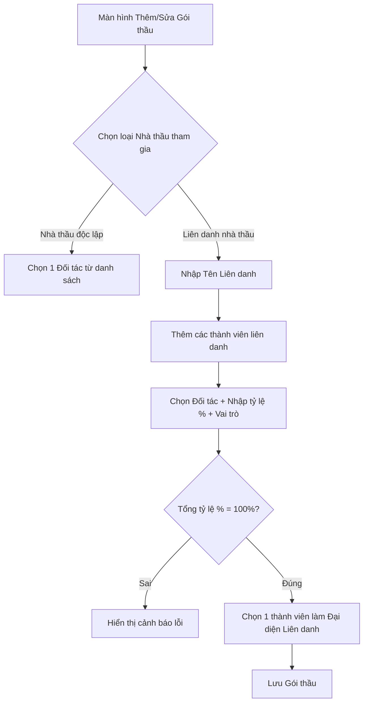

# Hướng dẫn luồng nghiệp vụ & UI/UX: Liên danh nhà thầu

Tài liệu này hướng dẫn luồng nghiệp vụ và cách thiết kế giao diện (UI) ở Frontend để hiển thị và thao tác cấu hình liên danh nhà thầu cho gói thầu và hợp đồng.

---

## 1. Luồng nghiệp vụ trên UI

---

## 2. Gợi ý thiết kế giao diện (UI Mockup)

### A. Màn hình Chi tiết / Tạo mới Gói thầu
Tại khu vực chọn nhà thầu thực hiện gói thầu, thiết kế một Component linh hoạt hỗ trợ 2 chế độ:

1. **Tab/Radio Group:**
   * `[ ] Nhà thầu Độc lập`
   * `[x] Liên danh Nhà thầu`

2. **Khi chọn "Liên danh Nhà thầu":**
   * **Trường nhập liệu:** `Tên Liên danh` (Ví dụ: *Liên danh Xây dựng Số 1 - Vinaconex*)
   * **Bảng danh sách thành viên liên danh (Dynamic Table / List):**
     
     | Thành viên (Đối tác) | Tỷ lệ đảm nhận (%) | Thành viên đại diện | Vai trò đảm nhận | Hành động |
     | :--- | :---: | :---: | :--- | :---: |
     | Công ty Cổ phần A (Dropdown) | `[ 60 ] %` | `(x) Đại diện` | `[ Thi công kết cấu ]` | `[Xóa]` |
     | Công ty TNHH B (Dropdown) | `[ 40 ] %` | `( )` | `[ Cung cấp thiết bị ]` | `[Xóa]` |
     
     * *Nút:* `[+ Thêm thành viên liên danh]`
     * *Validation dưới chân bảng:* **Tổng tỷ lệ hiện tại: 100%** (Hiển thị màu đỏ nếu $\neq 100\%$, màu xanh lá nếu $= 100\%$).

---

## 3. Quy tắc kiểm tra (Validation Rules) dành cho Frontend
* **Ít nhất 2 thành viên:** Một liên danh phải có tối thiểu 2 nhà thầu thành viên.
* **Bắt buộc có Đại diện:** Phải chọn duy nhất một Radio Button làm **Thành viên đại diện/đứng đầu liên danh**.
* **Tổng tỷ lệ = 100%:** Frontend nên tự động tính tổng trường `TyLeLienDanh` của các thành viên đang nhập và báo lỗi nếu tổng không bằng 100% trước khi cho phép submit.
